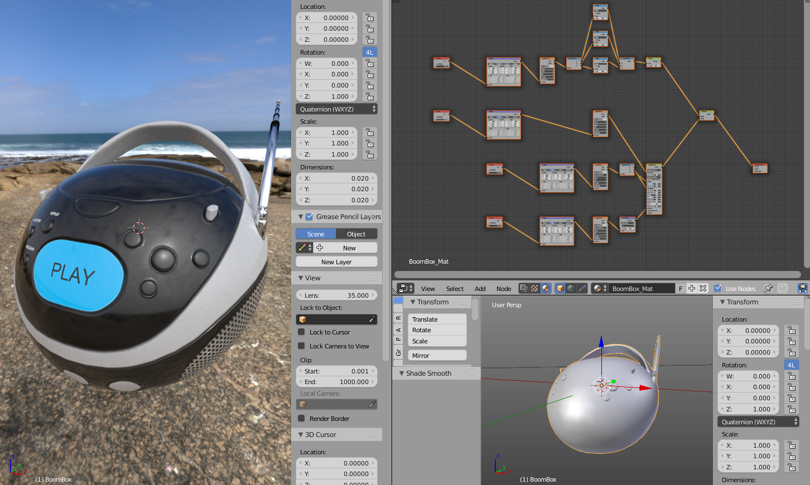
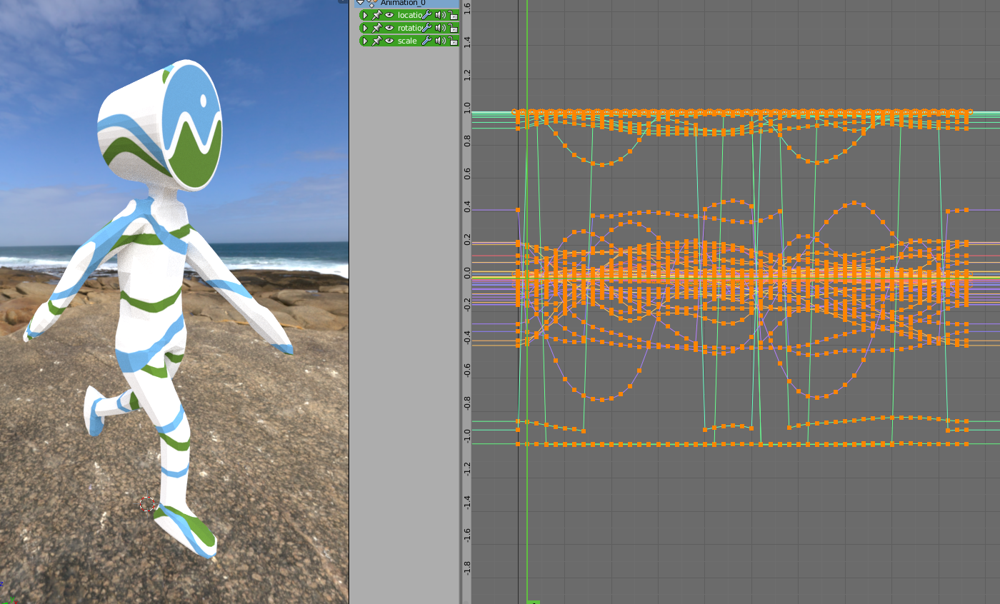
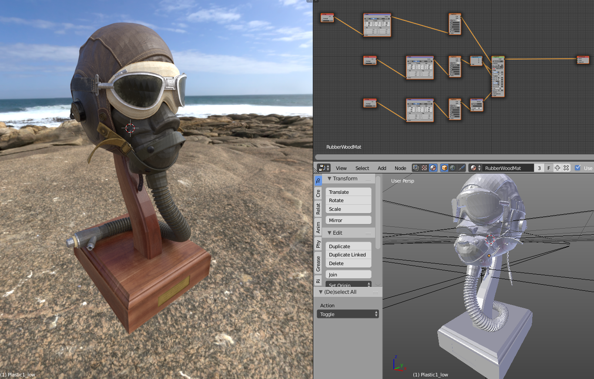

# Important note

This addon code is now merge into [Blender 2.8 repository][7], via [official glTF 2.0 Blender IO addon from KhronosGroup][6].  

# Installation

If you are using Blender 2.8, addon is activated by default, you don't need to install or activate anything.  
If you are using Blender 2.79, please install [official glTF 2.0 Blender IO addon from KhronosGroup][6].

# Examples

  

  

(These glTF files are from [glTF samples](https://github.com/KhronosGroup/glTF-Sample-Models))

# Thanks

This development is done in strong collaboration with [Airbus Defence & Space][5]

# Contribute
*  Please use [Official glTF-Blender-IO addon][6] instead of this one.
*  Don't hesitate to contact me, you will find my email and phone number on my [website](http://julienduroure.com).

# Releases
*  Please use [Official glTF-Blender-IO addon][6] instead of this one.

[1]: https://github.com/KhronosGroup/glTF-Blender-Exporter
[2]: https://github.com/ksons/gltf-blender-importer
[3]: https://github.com/KhronosGroup/glTF/blob/master/specification/2.0/figures/gltfOverview-2.0.0a.png
[4]: https://github.com/KhronosGroup/glTF-Sample-Models
[5]: http://www.airbus.com/space.html
[6]: https://github.com/KhronosGroup/glTF-Blender-IO
[7]: http://blender.org
